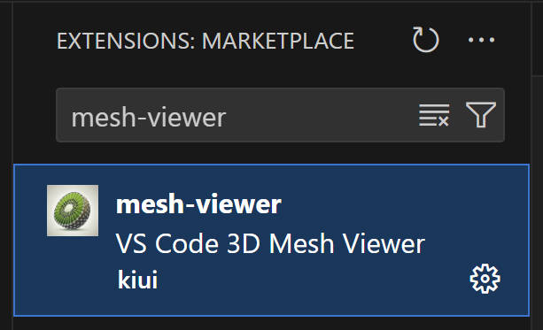
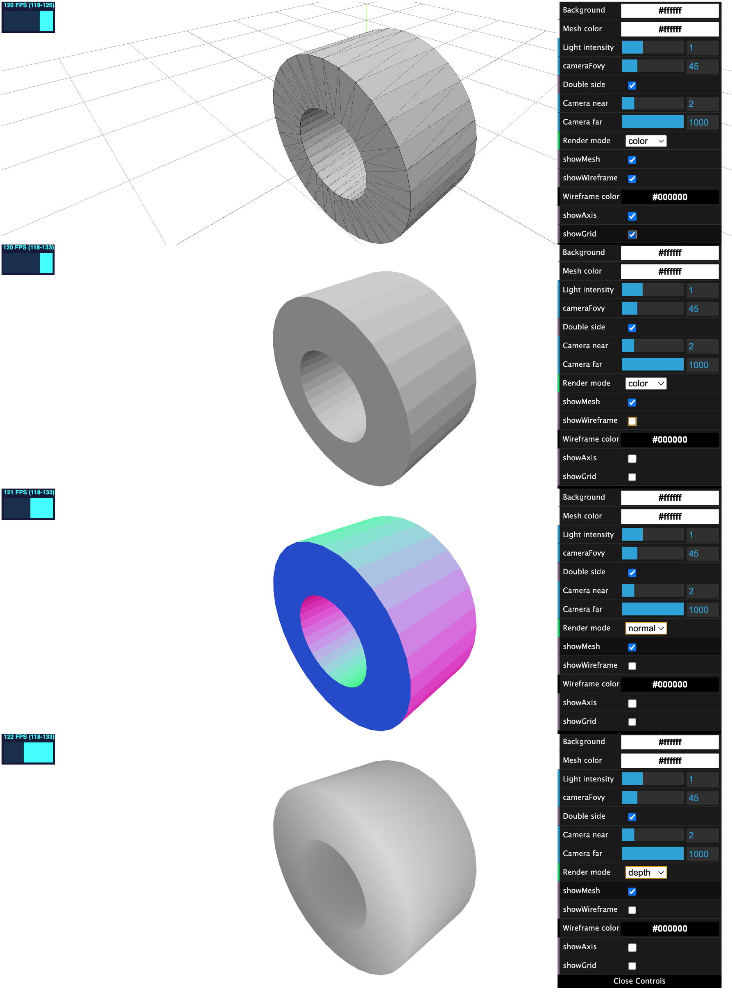

<p align="center">
    <picture>
    
    </picture>
    </br>
    <b>VS Code Mesh Viewer</b>
</p>

[](https://opensource.org/licenses/MIT)
[](https://marketplace.visualstudio.com/items?itemName=kiui.mesh-viewer)


This extension is modified from [vscode-3d-preview](https://github.com/tatsy/vscode-3d-preview) with the following features:
* Preview meshes in GLB/GLTF/OBJ/PLY formats with texture.
* Play GLB/GLTF animations.
* Default to white background.

### Install


Search in Marketplace: [mesh-viewer](https://marketplace.visualstudio.com/items?itemName=kiui.mesh-viewer).



### Mesh preview

<video controls>
  <source src="assets/demo.mp4" type="video/mp4">
</video>



## Development
Install `Node.js` and `npm` first, then clone this repo and:

```bash
# install dependencies
npm install 

# use F5 or the dubugger panel to start debugging (will open a new VSCode window with this extension enabled.)
# Help->Toggle Developer Tools (or Shift-Control-I) to see console output.

# publish (requires vsce, a publisher as defined in package.json, and the personal access token)
# first change version in package.json
vsce publish
```

## Acknowledgements & Reference

* [vscode-3d-preview](https://github.com/tatsy/vscode-3d-preview)
* [vscode-3dviewer](https://github.com/stef-levesque/vscode-3dviewer)
* [vscode-pc-viewer](https://github.com/Obarads/vscode-pc-viewer)
* [three.js](https://threejs.org/)
