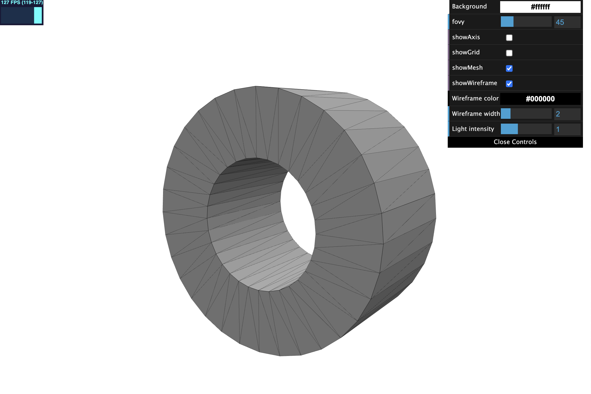

# VSCode 3D Mesh Viewer

[](https://opensource.org/licenses/MIT)
[](https://marketplace.visualstudio.com/items?itemName=kiui.mesh-viewer)


Marketplace: [kiui.mesh-viewer](https://marketplace.visualstudio.com/items?itemName=kiui.mesh-viewer)

## Description

This extension is modified from [vscode-3d-preview](https://github.com/tatsy/vscode-3d-preview) with the following features:
* Preview meshes in GLB/GLTF/OBJ/PLY formats.
* Defaults to white background.

#### Mesh preview



## Development
Install Node.js and npm first, then clone this repo and:

```bash
# install dependencies
npm install 

# use F5 or the dubugger panel to start debugging (will open a new VSCode window with this extension enabled.)
# Help->Toggle Developer Tools (or Shift-Control-I) to see console output.

# publish (requires vsce and personal access token)
vsce publish
```

## Acknowledgements & Reference

* [vscode-3d-preview](https://github.com/tatsy/vscode-3d-preview)
* [vscode-3dviewer](https://github.com/stef-levesque/vscode-3dviewer)
* [vscode-pc-viewer](https://github.com/Obarads/vscode-pc-viewer)
* [three.js](https://threejs.org/)
